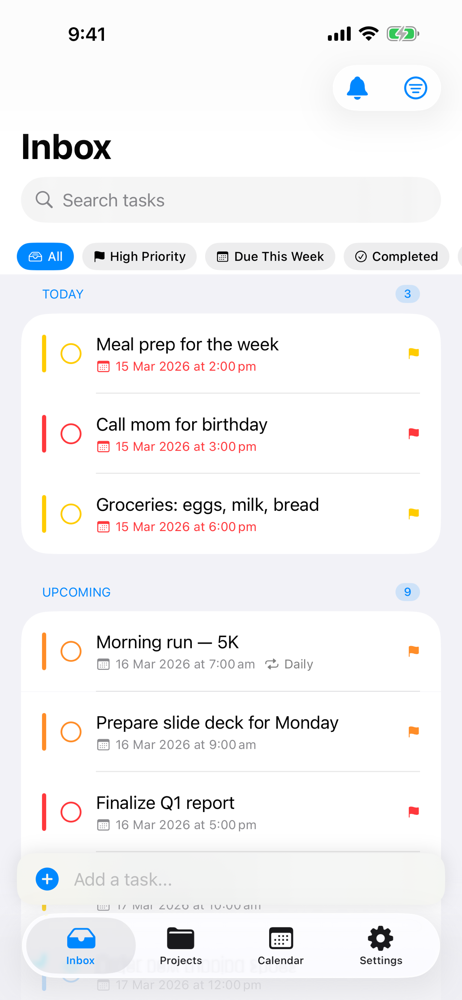
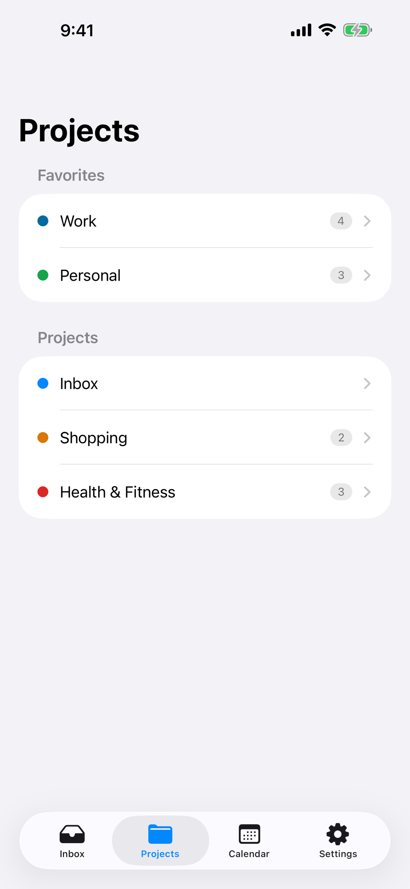
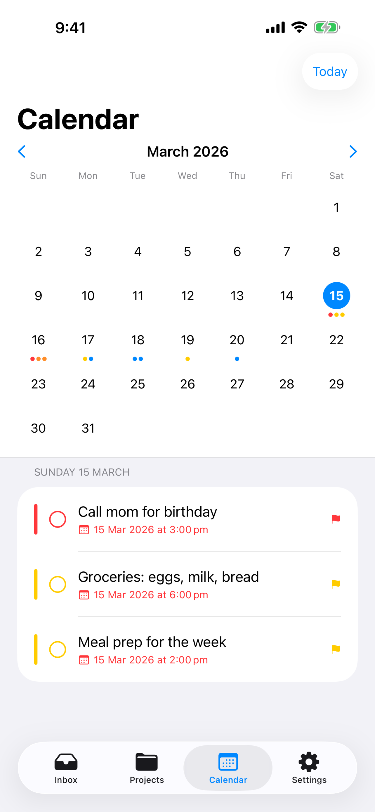
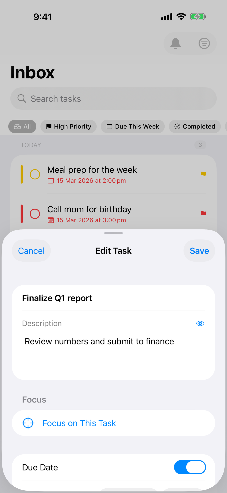
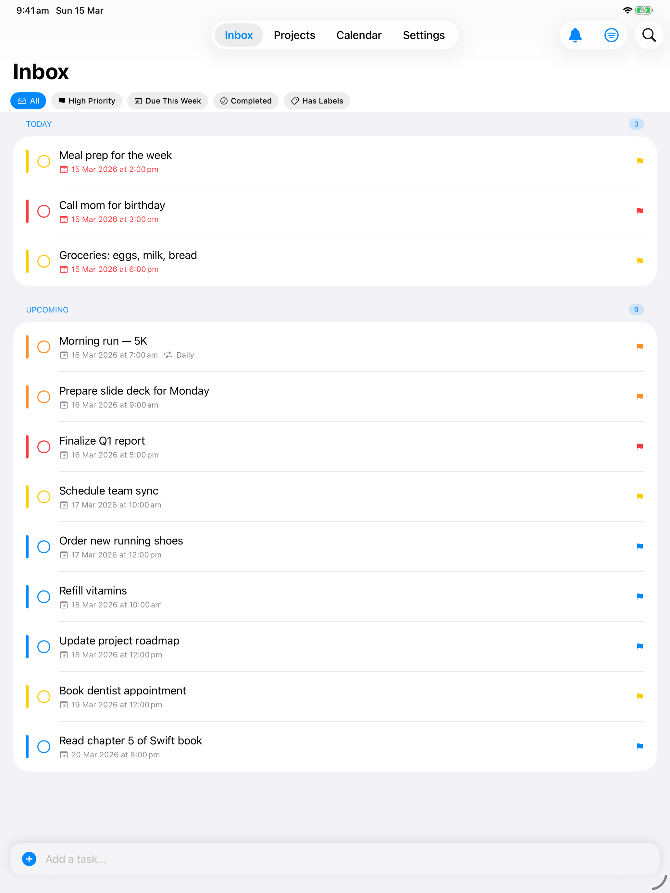
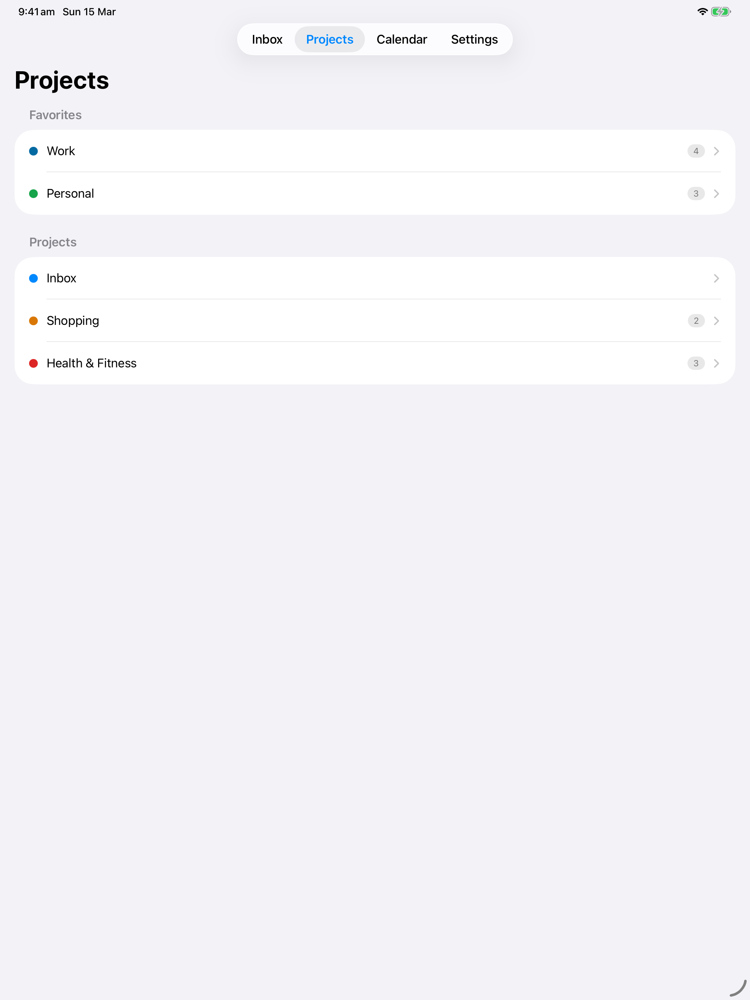

# mDone

[](LICENSE)
[]()
[](https://swift.org)

A native iOS and macOS task management app for your self-hosted [Vikunja](https://vikunja.io) server. A polished, focused interface for your self-hosted productivity setup.

## Screenshots

### iPhone

<p align="center">
  
  
  
  
</p>

### iPad

<p align="center">
  
  
</p>

## Features

- **Smart Lists** — Today, Upcoming, and Overdue views so you always know what to focus on next
- **Projects & Favorites** — Organize tasks into projects and pin your most-used ones to the sidebar
- **Home Screen & Lock Screen Widgets** — See your tasks at a glance without opening the app
- **Focus Timer with Live Activities** — Built-in timer with Dynamic Island and lock screen support
- **Repeating Tasks** — Daily, weekly, monthly, or custom intervals with automatic next-occurrence generation
- **Calendar View** — Visualize your tasks across days and weeks
- **Offline Support** — Local caching with automatic sync when connectivity is restored
- **Privacy First** — Zero analytics, zero tracking, zero third-party SDKs. Talks only to your Vikunja server

## Requirements

- iOS 18.0+ or macOS 15.0+
- A self-hosted [Vikunja](https://vikunja.io) server instance
- An account on that server

## Building from Source

The project uses [XcodeGen](https://github.com/yonaskolb/XcodeGen) to generate the Xcode project from `project.yml`. Pure Swift with SwiftUI — no external dependencies.

```bash
# Install XcodeGen (if needed)
brew install xcodegen

# Generate the Xcode project
xcodegen generate

# Build for iOS Simulator
xcodebuild -project mDone.xcodeproj -scheme mDone -sdk iphonesimulator \
  -destination 'platform=iOS Simulator,name=iPhone 16' build

# Build for macOS
xcodebuild -project mDone.xcodeproj -scheme mDone-macOS build

# Run tests
xcodebuild -project mDone.xcodeproj -scheme mDone -sdk iphonesimulator \
  -destination 'platform=iOS Simulator,name=iPhone 16' test
```

## Contributing

Contributions are welcome! Please see [CONTRIBUTING.md](CONTRIBUTING.md) for guidelines.

## Privacy

mDone does not collect, track, or share any personal data. The app communicates exclusively with the Vikunja server you configure. See the full [Privacy Policy](docs/privacy-policy.html).

## License

[MIT](LICENSE)

## Links

- [Vikunja](https://vikunja.io) — The open-source task management platform mDone connects to
- [Issues](https://github.com/marco308/mdone/issues) — Report bugs or request features
- [Roadmap](docs/ISSUES.md) — Planned features and enhancements
